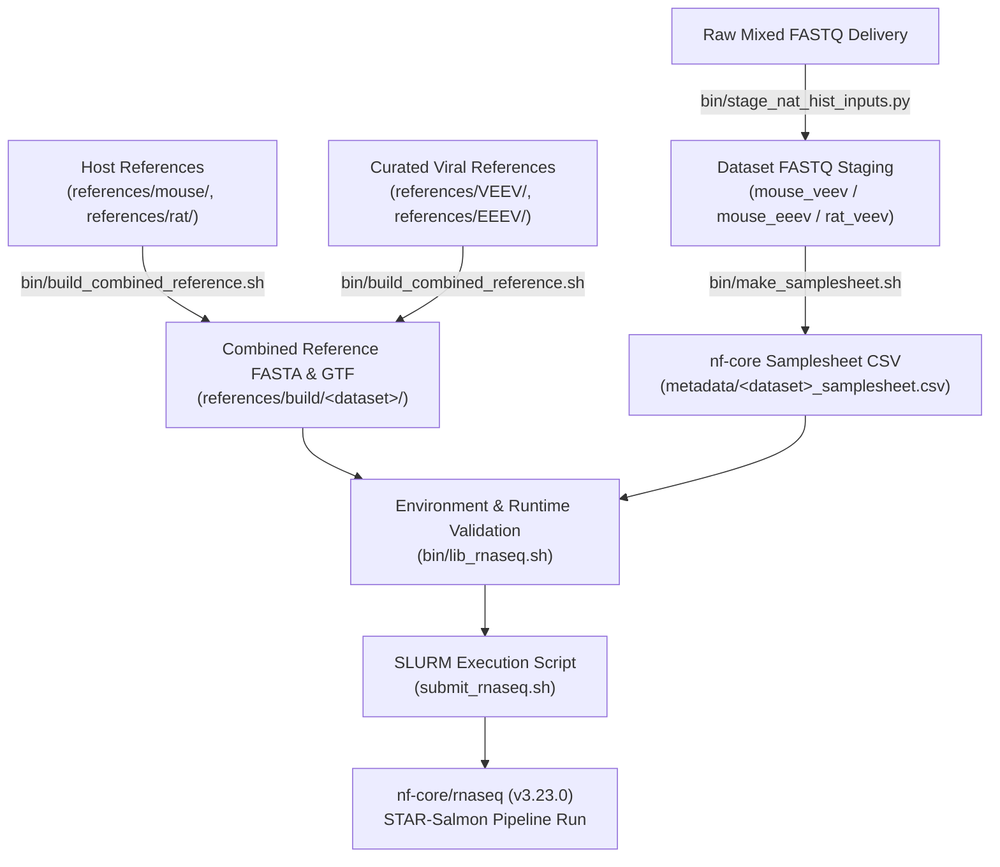

# Alphavirus RNA-seq HPC Wrapper

[](https://github.com/aleponce4/rnaseq-nfcore-wrapper-alphavirus/actions/workflows/ci.yml)

Wrapper repo for running [`nf-core/rnaseq`](https://nf-co.re/rnaseq) (`3.23.0`) on the V-EEEV natural history datasets on HPC.
RNA-seq workflow used for analysis of alphavirus infection studies.  
Supports mixed host/viral transcriptome analysis across multiple species (mouse and rat) with automated dataset staging and reference preparation.

This repo contains **no pipeline of its own** — all read processing, alignment,
and quantification is done by the upstream community pipeline `nf-core/rnaseq`.
See [Upstream pipeline & attribution](#upstream-pipeline--attribution).

It does four things:

1. stages a mixed FASTQ delivery into dataset-specific folders
2. builds combined host + virus references
3. generates nf-core samplesheets
4. launches `nf-core/rnaseq`

---

## Operational Use

- **Workload**: Paired-end RNA-seq across three datasets covering two host species (mouse and rat) and two Alphavirus strains (VEEV, EEEV). Per-dataset sample counts and run outcomes are unpublished study data and are not recorded in this repo.
- **Primary Environment**: Institutional HPC cluster (ISAAC HPC at UTK / University of Tennessee Knoxville) running SLURM workload manager.
- **Workflow Engine & Pipeline**: Nextflow `25.04.3` launching `nf-core/rnaseq` `3.23.0` with STAR-Salmon alignment and quantification (`--aligner star_salmon`).
- **Containerization**: Singularity/Apptainer container engine with automated container precaching (`bin/precache_nfcore_containers.sh`).
- **Failure Handling**: Built-in resume capability (`-resume`) and scratch directory storage routing.

---

## Architecture & Data Flow



---

## Expected Input

FASTQs:

- Input FASTQs are paired-end and named like `SAMPLE_R1_001.fastq.gz` and `SAMPLE_R2_001.fastq.gz`
- If starting from the mixed `V-EEEV Nat Hist` delivery, use `bin/stage_nat_hist_inputs.py`
- That script classifies samples into:
  - `mouse_veev`
  - `mouse_eeev`
  - `rat_veev`

References:

- `references/mouse/`: one mouse FASTA and one mouse GTF
- `references/rat/`: one rat FASTA and one rat GTF
- `references/VEEV/`: `virus.fa` and `virus.gtf`
- `references/EEEV/`: `virus.fa` and `virus.gtf`

Reference folders are split by role:

- `references/` holds the active pipeline-facing references used by runs
- `viral_reference_work/raw/` holds the public viral source FASTA/GFF3/GTF files the curated references are built from
- `viral_reference_work/curation/` and `viral_reference_work/polish/` are output directories for `bin/curate_viral_references.py` and `bin/polish_virus_reference_from_bams.py`. Their contents are per-sample study measurements, are untracked (see `.gitignore`), and are regenerated on each run

The repo already includes curated viral references in [references/VEEV/virus.fa](references/VEEV/virus.fa), [references/VEEV/virus.gtf](references/VEEV/virus.gtf), [references/EEEV/virus.fa](references/EEEV/virus.fa), and [references/EEEV/virus.gtf](references/EEEV/virus.gtf).

---

## Execution Modes

The wrapper supports three distinct operational execution modes:

### 1. Preflight Validation Mode
Runs cheap structural checks without requesting compute node resources or queuing SLURM jobs (`check_fastq_inputs` / `check_reference_inputs` in [bin/lib_rnaseq.sh](bin/lib_rnaseq.sh)):

- the FASTQ input directory exists and contains **at least one** `*_R1_001.fastq.gz` file
- the host and virus reference directories exist and each resolve to **exactly one** FASTA and **exactly one** GTF/GFF

It does *not* verify R1/R2 pairing — that check lives in [bin/make_samplesheet.sh](bin/make_samplesheet.sh), which fails with `Missing mate` when an R2 is absent, and runs later during samplesheet generation (step 4 of [What `submit_rnaseq.sh` Does](#what-submit_rnaseqsh-does)).

```bash
PREFLIGHT_ONLY=1 bash submit_rnaseq.sh mouse_veev
```

### 2. Smoke Test Mode
Generates tiny downsampled paired-end FASTQ subsets (`bin/prepare_smoke_inputs.py`) and verifies end-to-end execution flow before running full datasets:
```bash
# Preflight check on smoke subset
SMOKE_TEST=1 PREFLIGHT_ONLY=1 bash submit_rnaseq.sh mouse_veev

# Run smoke test via SLURM
SMOKE_TEST=1 sbatch submit_rnaseq.sh mouse_veev
```

### 3. Full-dataset SLURM execution
Submits full dataset analysis jobs to the SLURM batch queue on ISAAC HPC:
```bash
sbatch submit_rnaseq.sh mouse_veev
sbatch submit_rnaseq.sh mouse_eeev
sbatch submit_rnaseq.sh rat_veev
```

---

## Basic Workflow Setup

Stage the mixed delivery:

```bash
python3 bin/stage_nat_hist_inputs.py "/path/to/V-EEEV Nat Hist"
```

Download host references if needed:

```bash
bash bin/download_host_references.sh all
```

Edit cluster/runtime settings:

```bash
nano settings.env
```

---

## Required Environment

A real (non-preflight, non-dry-run) submission will not start unless all of the
following are set. `submit_rnaseq.sh` fails fast with an explicit message for
each.

| Variable | Required for | Default | Notes |
| --- | --- | --- | --- |
| `ISAAC_ACCOUNT` | every real run | `ACF-UTKXXXX` (template) | Your Slurm allocation account. The launcher **refuses to run** while this is still the literal template value. Set it in `settings.env` or export it. |
| `SBATCH_ACCOUNT` | recommended | `$ISAAC_ACCOUNT` | Charges the manager job to the same account. |
| `SCRATCHDIR` | every real run | *(none — must be set)* | Root of your scratch filesystem. See below. |
| `HPC_PARTITION` | portability | `campus` | Slurm partition for the Nextflow child jobs. |
| `HPC_QOS` | portability | `campus` | Slurm QoS for the Nextflow child jobs. |

### `SCRATCHDIR`

Every runtime path in `settings.env` is derived from `SCRATCHDIR`, and all of
them stay **empty** until it is set:

- `RESULTS_BASE` → `$SCRATCHDIR/veeev_nat_hist_nfcore/results`
- `WORK_ROOT` → `$SCRATCHDIR/veeev_nat_hist_nfcore/work`
- `RESULTS_BASE_SMOKE` → `$SCRATCHDIR/veeev_nat_hist_nfcore/results_smoke`
- `WORK_ROOT_SMOKE` → `$SCRATCHDIR/veeev_nat_hist_nfcore/work_smoke`
- `CONTAINER_CACHE` → `$SCRATCHDIR/veeev_nat_hist_nfcore/containers`
- `NXF_HOME` → `$SCRATCHDIR/veeev_nat_hist_nfcore/.nextflow`

ISAAC-NG exports `SCRATCHDIR` for you in batch jobs. On any other cluster (or in
an interactive shell) export it yourself before launching:

```bash
export SCRATCHDIR=/path/to/your/scratch
```

`submit_rnaseq.sh` exits with `SCRATCHDIR is required on ISAAC-NG` if it is
unset, and with `Scratch-backed runtime paths are empty; confirm SCRATCHDIR is
exported before launch` if it was set too late for `settings.env` to expand it.
Preflight and dry-run modes do not need it.

### Partition and QoS overrides

The `#SBATCH` directives in `submit_rnaseq.sh` and `submit_virus_polish.sh` name
the `campus` partition/QoS. Slurm parses those lines before any shell code runs,
so they cannot read environment variables. Everything under shell/Nextflow
control does: `nextflow.config` routes the child jobs via `HPC_PARTITION` and
`HPC_QOS`, both defaulting to `campus`.

To move a run to a different partition, set both and pass matching flags to
`sbatch`:

```bash
export HPC_PARTITION=long HPC_QOS=long
sbatch -p "$HPC_PARTITION" -q "$HPC_QOS" --time=48:00:00 \
  submit_rnaseq.sh mouse_veev
```

The chosen partition/QoS is echoed by both preflight and launch output so you
can confirm what the child jobs will use.

---

## Known Working ISAAC Runtime

Do not rely on the cluster default `nextflow` module alone. On ISAAC it can
resolve to an old `20.04.1` launcher, which is too old for `nf-core/rnaseq 3.23.0`.

Known-good bootstrap:

```bash
mkdir -p "$HOME/bin"
cd "$HOME/bin"
curl -s https://get.nextflow.io | bash
chmod +x nextflow

module purge
module load openjdk/17.0.0_35
export PATH="$HOME/bin:$PATH"
export NXF_VER=25.04.3
export SKIP_MODULE_LOAD=1

which nextflow
java -version
nextflow -version
```

The wrapper checks both runtimes before launch via `bin/lib_rnaseq.sh` and prints the detected `java` and `nextflow` paths and versions. The corresponding defaults in `settings.env` are:

- `JAVA_MODULE=openjdk/17.0.0_35`
- `NEXTFLOW_BIN_DIR=$HOME/bin`
- `NXF_VER=25.04.3`

---

## What `submit_rnaseq.sh` Does

For the selected dataset, the launcher:

1. checks inputs and references (`check_fastq_inputs`, `check_reference_inputs`)
2. builds `references/build/<dataset>/combined.fa`
3. builds `references/build/<dataset>/combined.gtf`
4. writes `metadata/<dataset>_samplesheet.csv`
5. runs `nextflow run nf-core/rnaseq -r 3.23.0`

The nf-core run uses:

- `--aligner star_salmon`
- `-profile "$NFCORE_PROFILE"`
- `-c nextflow.config`

---

## Useful Commands

Make a samplesheet manually:

```bash
bash bin/make_samplesheet.sh inputs/mouse_veev metadata/mouse_veev_samplesheet.csv
```

Build a combined reference manually:

```bash
bash bin/build_combined_reference.sh mouse_veev
```

Print the exact Nextflow command without running (dry run):

```bash
DRY_RUN=1 SKIP_MODULE_LOAD=1 SKIP_RUNTIME_CHECK=1 bash submit_rnaseq.sh mouse_veev
```

Pre-cache nf-core containers:

```bash
bash bin/precache_nfcore_containers.sh
```

---

## Output Locations

Main outputs go to scratch-backed paths from `settings.env` (all derived from
`SCRATCHDIR` — see [Required Environment](#required-environment)):

- `RESULTS_BASE/<dataset>`
- `WORK_ROOT/<dataset>`
- `CONTAINER_CACHE`

Smoke test outputs go to:

- `RESULTS_BASE_SMOKE/<dataset>`
- `WORK_ROOT_SMOKE/<dataset>`

---

## Requirements

- Slurm Workload Manager
- Java `>= 17`
- Nextflow `>= 25.04.3`
- Singularity or Apptainer
- Python 3 (`pytest` for automated test execution)

This repo is meant as a practical run wrapper for institutional HPC execution.

---

## Upstream pipeline & attribution

All read QC, trimming, alignment, and quantification in this project is performed
by **[nf-core/rnaseq](https://github.com/nf-core/rnaseq)** `3.23.0` — pipeline
docs at <https://nf-co.re/rnaseq/3.23.0>. This repository contains no analysis
pipeline of its own. It is a thin site-specific wrapper that stages inputs,
builds combined host + virus references, writes nf-core samplesheets, and
submits `nextflow run nf-core/rnaseq -r 3.23.0` to Slurm.

nf-core/rnaseq is developed by the nf-core community and distributed under the
MIT License. It is not affiliated with, and does not endorse, this wrapper.

If you use this wrapper, please cite the upstream pipeline and framework, not
just this repo:

> Patel H, Ewels P, Peltzer A, Manning J, Botvinnik O, Sturm G, Moreno D,
> Vemuri P, Silviu-Alin B, Pantano L, Binzer-Panchal M, Syme R, Zepper M,
> Kelly G, Espinosa-Carrasco J, Hörtenhuber M, Cheshire C, rnaseq: nf-core/rnaseq.
> Zenodo. <https://doi.org/10.5281/zenodo.1400710>

> Ewels PA, Peltzer A, Fillinger S, Patel H, Alneberg J, Wilm A, Garcia MU,
> Di Tommaso P, Nahnsen S. **The nf-core framework for community-curated
> bioinformatics pipelines.** *Nature Biotechnology* 38, 276–278 (2020).
> <https://doi.org/10.1038/s41587-020-0439-9>

> Di Tommaso P, Chatzou M, Floden EW, Barja PP, Palumbo E, Notredame C.
> **Nextflow enables reproducible computational workflows.**
> *Nature Biotechnology* 35, 316–319 (2017).
> <https://doi.org/10.1038/nbt.3820>

Third-party reference sequences under `viral_reference_work/raw/` and
`references/` come from public NCBI GenBank records (for example `KP282670.1`)
and retain their original terms.

---

## License

This wrapper is released under the MIT License — see [LICENSE](LICENSE).

The license covers the wrapper code in this repository only. It does not extend
to the upstream `nf-core/rnaseq` pipeline (MIT, separately licensed by the
nf-core community), to the containers that pipeline pulls, or to third-party
reference data.

No study data is distributed in this repository. Sample-level measurements,
sample counts, and run outputs are unpublished and deliberately excluded; input
FASTQs and run artifacts are untracked via `.gitignore`.
