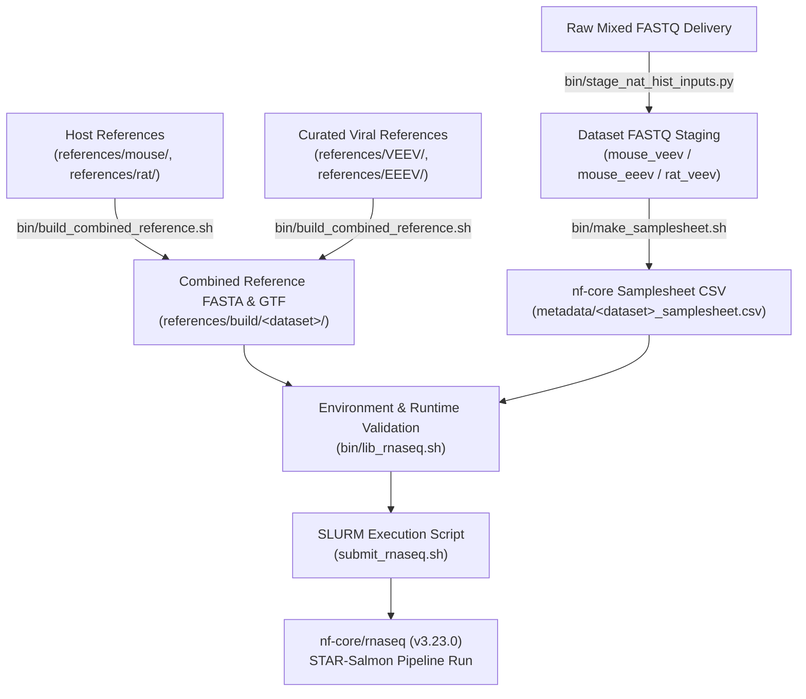

# Alphavirus RNA-seq HPC Wrapper

[](https://github.com/aleponce4/rnaseq-nfcore-wrapper-alphavirus/actions/workflows/ci.yml)

Wrapper repo for running `nf-core/rnaseq` (`3.23.0`) on the V-EEEV natural history datasets on HPC.
RNA-seq workflow used for analysis of alphavirus infection studies.  
Supports mixed host/viral transcriptome analysis across multiple species (mouse and rat) with automated dataset staging and reference preparation.

It does four things:

1. stages a mixed FASTQ delivery into dataset-specific folders
2. builds combined host + virus references
3. generates nf-core samplesheets
4. launches `nf-core/rnaseq`

---

## Operational Use

- **Workload**: Processed 84 paired-end RNA-seq samples across multiple host species (mouse and rat) and Alphavirus strains (VEEV, EEEV).
- **Primary Environment**: Institutional HPC cluster (ISAAC HPC at UTK / University of Tennessee Knoxville) running SLURM workload manager.
- **Workflow Engine & Pipeline**: Nextflow `25.04.3` launching `nf-core/rnaseq` `3.23.0` with STAR-Salmon alignment and quantification (`--aligner star_salmon`).
- **Containerization**: Singularity/Apptainer container engine with automated container precaching (`bin/precache_nfcore_containers.sh`).
- **Failure Handling**: Built-in resume capability (`-resume`) and scratch directory storage routing.

---

## Architecture & Data Flow



---

## Expected Input

FASTQs:

- Input FASTQs are paired-end and named like `SAMPLE_R1_001.fastq.gz` and `SAMPLE_R2_001.fastq.gz`
- If starting from the mixed `V-EEEV Nat Hist` delivery, use `bin/stage_nat_hist_inputs.py`
- That script classifies samples into:
  - `mouse_veev`
  - `mouse_eeev`
  - `rat_veev`

References:

- `references/mouse/`: one mouse FASTA and one mouse GTF
- `references/rat/`: one rat FASTA and one rat GTF
- `references/VEEV/`: `virus.fa` and `virus.gtf`
- `references/EEEV/`: `virus.fa` and `virus.gtf`

Reference folders are split by role:

- `references/` holds the active pipeline-facing references used by runs
- `viral_reference_work/` holds viral source files and derived work products such as raw source annotations, curation tables, and polish outputs

The repo already includes curated viral references in [references/VEEV/virus.fa](references/VEEV/virus.fa), [references/VEEV/virus.gtf](references/VEEV/virus.gtf), [references/EEEV/virus.fa](references/EEEV/virus.fa), and [references/EEEV/virus.gtf](references/EEEV/virus.gtf).

---

## Execution Modes

The wrapper supports three distinct operational execution modes:

### 1. Preflight Validation Mode
Validates directory structure, FASTQ file existence, paired-end matching, and reference FASTA/GTF files without requesting compute node resources or queuing SLURM jobs:
```bash
PREFLIGHT_ONLY=1 bash submit_rnaseq.sh mouse_veev
```

### 2. Smoke Test Mode
Generates tiny downsampled paired-end FASTQ subsets (`bin/prepare_smoke_inputs.py`) and verifies end-to-end execution flow before running full datasets:
```bash
# Preflight check on smoke subset
SMOKE_TEST=1 PREFLIGHT_ONLY=1 bash submit_rnaseq.sh mouse_veev

# Run smoke test via SLURM
SMOKE_TEST=1 sbatch submit_rnaseq.sh mouse_veev
```

### 3. Full-dataset SLURM execution
Submits full dataset analysis jobs to the SLURM batch queue on ISAAC HPC:
```bash
sbatch submit_rnaseq.sh mouse_veev
sbatch submit_rnaseq.sh mouse_eeev
sbatch submit_rnaseq.sh rat_veev
```

---

## Basic Workflow Setup

Stage the mixed delivery:

```bash
python3 bin/stage_nat_hist_inputs.py "/path/to/V-EEEV Nat Hist"
```

Download host references if needed:

```bash
bash bin/download_host_references.sh all
```

Edit cluster/runtime settings:

```bash
nano settings.env
```

Important setting:

- set `ISAAC_ACCOUNT` to the real account instead of `ACF-UTKXXXX`

---

## Known Working ISAAC Runtime

Do not rely on the cluster default `nextflow` module alone. On ISAAC it can
resolve to an old `20.04.1` launcher, which is too old for `nf-core/rnaseq 3.23.0`.

Known-good bootstrap:

```bash
mkdir -p "$HOME/bin"
cd "$HOME/bin"
curl -s https://get.nextflow.io | bash
chmod +x nextflow

module purge
module load openjdk/17.0.0_35
export PATH="$HOME/bin:$PATH"
export NXF_VER=25.04.3
export SKIP_MODULE_LOAD=1

which nextflow
java -version
nextflow -version
```

The wrapper checks both runtimes before launch via `bin/lib_rnaseq.sh` and prints the detected `java` and `nextflow` paths and versions. The corresponding defaults in `settings.env` are:

- `JAVA_MODULE=openjdk/17.0.0_35`
- `NEXTFLOW_BIN_DIR=$HOME/bin`
- `NXF_VER=25.04.3`

---

## What `submit_rnaseq.sh` Does

For the selected dataset, the launcher:

1. checks inputs and references (`check_fastq_inputs`, `check_reference_inputs`)
2. builds `references/build/<dataset>/combined.fa`
3. builds `references/build/<dataset>/combined.gtf`
4. writes `metadata/<dataset>_samplesheet.csv`
5. runs `nextflow run nf-core/rnaseq -r 3.23.0`

The nf-core run uses:

- `--aligner star_salmon`
- `-profile "$NFCORE_PROFILE"`
- `-c nextflow.config`

---

## Useful Commands

Make a samplesheet manually:

```bash
bash bin/make_samplesheet.sh inputs/mouse_veev metadata/mouse_veev_samplesheet.csv
```

Build a combined reference manually:

```bash
bash bin/build_combined_reference.sh mouse_veev
```

Print the exact Nextflow command without running (dry run):

```bash
DRY_RUN=1 SKIP_MODULE_LOAD=1 SKIP_RUNTIME_CHECK=1 bash submit_rnaseq.sh mouse_veev
```

Pre-cache nf-core containers:

```bash
bash bin/precache_nfcore_containers.sh
```

---

## Output Locations

Main outputs go to scratch-backed paths from `settings.env`:

- `RESULTS_BASE/<dataset>`
- `WORK_ROOT/<dataset>`
- `CONTAINER_CACHE`

Smoke test outputs go to:

- `RESULTS_BASE_SMOKE/<dataset>`
- `WORK_ROOT_SMOKE/<dataset>`

---

## Requirements

- Slurm Workload Manager
- Java `>= 17`
- Nextflow `>= 25.04.3`
- Singularity or Apptainer
- Python 3 (`pytest` for automated test execution)

This repo is meant as a practical run wrapper for institutional HPC execution.
